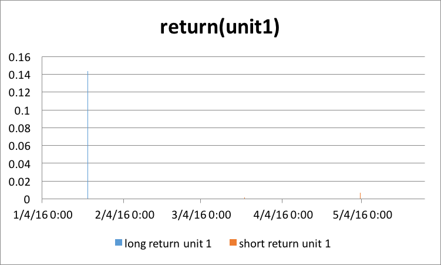
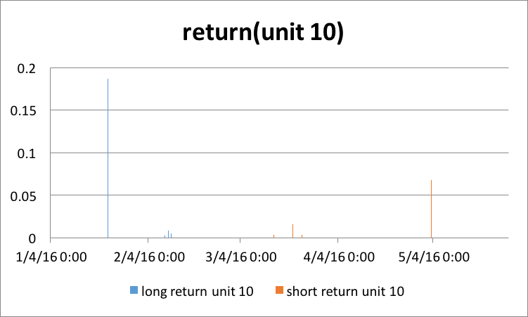
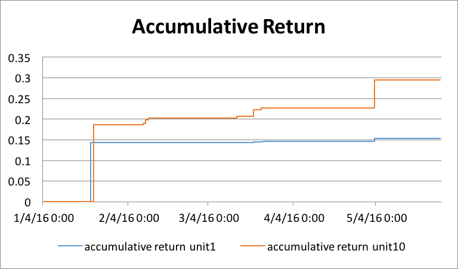
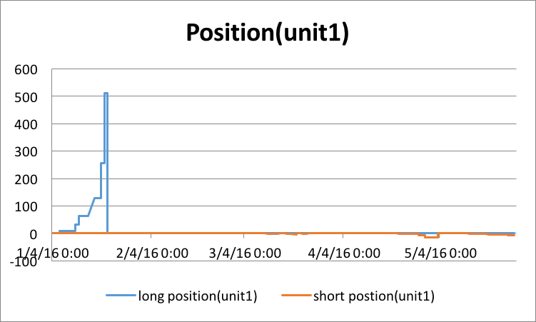
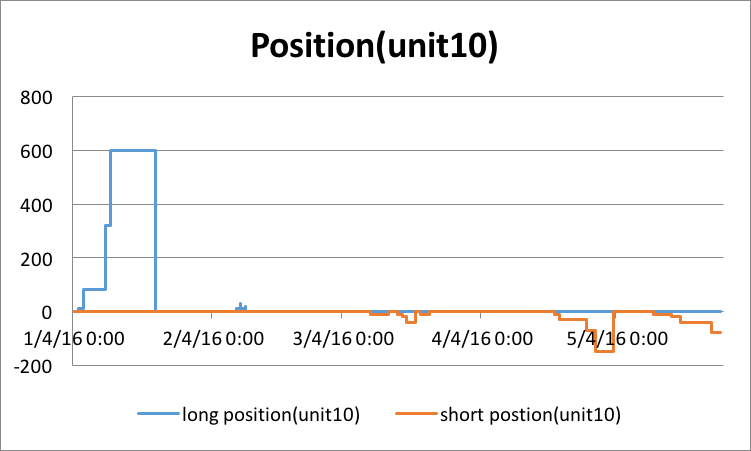

## Report for Double Down Strategy
###stragegy
- start date: 1/1/2016
- end date: 31/5/2016
- long at dmat_low, dmat_low - $1, ...
- short at dmat_high, dmat_high + $1, ...
- amount of contract for short and long are 1, 1, 2, 4, 8, 16, 32, 64, ...
- take profit at 3% for long and short (base on the average price)
- once exit, reset the corresponding position to 0 and set dmat value of that day as new entry price
- net position limit is 600
- capital is $ 3M
 
###result
- **return**

- **position** 

###analysis
- Position
	
	From 5/1 to 22/1, the price keeps going down, so the program keeps taking long position. The program takes a total 512 position for unit 1 and 600 position for unit10 (hits the limit position)

	From 10/3 to 25/5, the program takes some short position. The amount is not large
- Return

	For unit1, the total return in long position is around 14.35%, and in short is 0.92%
	
	For unit10, the total return in long position is around 20.30%, and in short is 9.2% 
- For the 18.65% return in long position
	
	The exit price is based on the cash flow, net position and take profit percentage. And the return is based on cash flow, net position, exit price and capital. The formula is as follow
	
	`exit price = abs(CF / net position) * (1 + take profit)`
	
	`return = 1000 * (CF - net position * exit price) / capital`
	
	`= abs(CF) * take profit * 1000 / capital = abs(CF) / 100,000`
	
	From the formula, if the CF is bigger and we actually take profit, the return will be higher. 
	
	On 2016-1-22, the CF is -18,651.0939 and we take profit, so the total return for the past long is `abs(CF) / 100,000 = 18.65%`
	