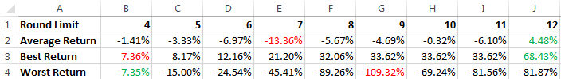
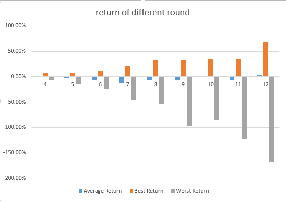
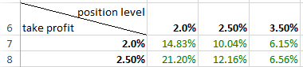

## Report for Double Down Strategy(v2)
###Strategy
- `start date`: 1/1/2016
- `end date`: 31/5/2016
- `position level` from 2.0%, 2.5%, 3.0% up to 5.0%(7 levels). It means the price levels that trigger long are dmat_low, dmat_low × (1-position level), dmat_low × (1-position level)^2, ....... And price levels that trigger short are dmat_high, dmat_high × (1+positon level), dmat_high × (1+position level)^2,......
- `take profit` from 2.0%, 2.5%, 3.0% up to 5.0%(7 levels)
- `stop loss` round limit from 4 to 12. (e.g. if stop loss round limit is 4, it means that when the price hits the 4th position level, the strategy will exit to stop loss). Once exit, reset the corresponding position to 0 and set dmat value of that day as new entry price
- `amount of contract` for short and long are 1, 1, 2, 4, 8, 16, 32, 64, 128, ...
- `unit` of contract in this test is 10
- `net position limit` is 600
- `capital` is $3M

###Result
- for each round limit, there is a sheet containing 49 data as follow (the round limit for the example picture is 4)
- The results are the total return for the corresponding `positon level`, `take profit level` and `round limit`. 
- The green ones are positive return and red ones are negative return. 
- The green one with yellow background is the best return at this round limit and the red one with yellow background is the worst return at this round limit

	

###Analysis
- Here are a table and a chart showing the average return, best return, worst return for each round limit

	

	
	
	As we can see from the table and the chart, with the round limit going up, the best return goes high and the worst return goes down quickly so the risk goes high quickly. If the round limit goes up, the money invested is more which end up with higher return or higher loss.

- Here are some combinations of `take profit level` and `position level` that level lose money with any round limit. And the return is the best return of the corresponding combination

	
	
	As we know that the return goes up with the round limit going up. The return of `position level` 2.0% reaches its highest value and never goes up at round limit 7, `position level` 2.50% at round limit 6 and `position level` 3.0% at round limit 5.
	
	So I think the best combination of these three parameters should be chosen from this table, where round limit is not that high， return is considerable and never lose money.