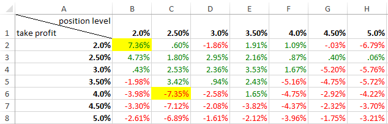

## Report for Double Down Strategy(v2)
###Strategy
- **start date**: 1/1/2016
- **end date**: 31/5/2016
- **position level** from 2.0%, 2.5%, 3.0% up to 5.0%(7 levels). It means the price levels that trigger long are dmat_low, dmat_low × (1-position level), dmat_low × (1-position level)^2, ....... And price levels that trigger short are dmat_high, dmat_high × (1+positon level), dmat_high × (1+position level)^2,......
- **take profit** from 2.0%, 2.5%, 3.0% up to 5.0%(7 levels)
- **stop loss** round limit from 4 to 12. (e.g. if stop loss round limit is 4, it means that when the price hits the 4th position level, the strategy will exit to stop loss). Once exit, reset the corresponding position to 0 and set dmat value of that day as new entry price
- **amount of contract** for short and long are 1, 1, 2, 4, 8, 16, 32, 64, 128, ...
- **unit** of contract in this test is 10
- net position limit is 600
- capital is $3M

###Result
- for each round limit, there is a sheet containing 49 data as follow
