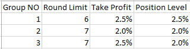
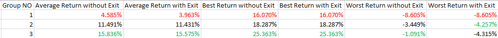
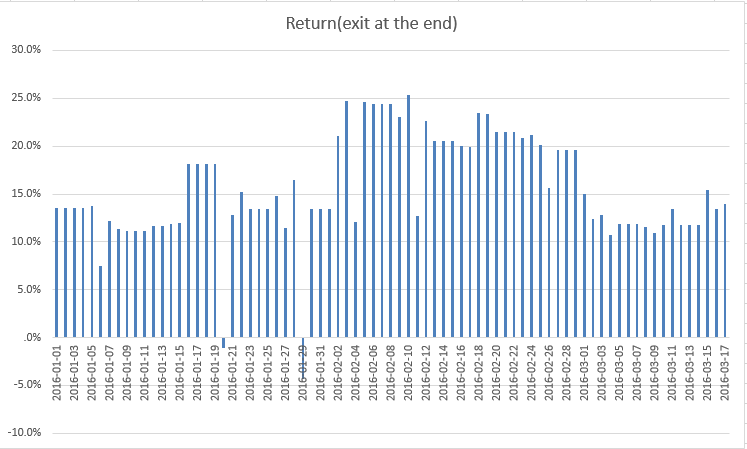

## Report for Double Down Strategy(v3)
###Strategy
- Each time interval to test is 3 months
- `start date`: from 1/1/2016 to 17/3/2016
- `end date`: from 31/3/2016 to 15/6/2016
- `position level`: It means the price levels that trigger long are dmatLow, dmatLow × (1-position level), dmatLow × (1-position level)^2, ....... And price levels that trigger short are dmatHigh, dmatHigh × (1+positon level), dmatHigh × (1+position level)^2,......
- `take profit`: It means that the stategy takes profit at what percent
- `round limit` If `round limit` for stop loss is 4, it means that when the price hits the 4th position level, the strategy will exit to stop loss). Once exit, reset the corresponding position to 0 and set dmat value of that day as new entry price
- `amount of contract` for short and long are 1, 1, 2, 4, 8, 16, 32, 64, 128, ...
- `unit` of contract in this test is 10
- `net position limit` is 600
- `capital` is $3M
- group of parameters: there are three group of parameters tested in this report

	

###Result
- Table
	

- Chart
	
	this is the chart for double down strategy starting from Jan.1 to Mar.17 with time interval 3 months. The round limit is 7, take profit at 2.5% and position level is 2.0%
	
	